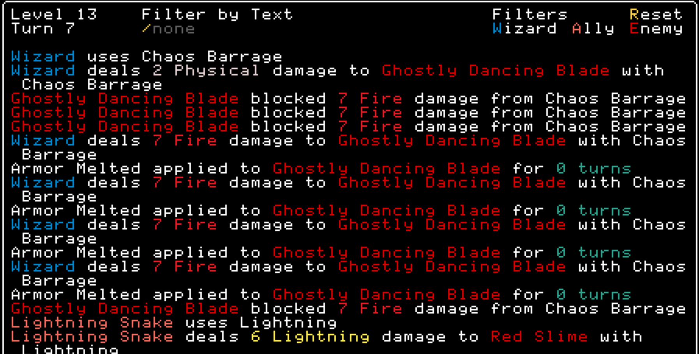

## Message Search

This mod adds a text search filter to the message log.

This was inspired by the
[ShopSearch](https://codeberg.org/danvolchek/rift-wizard-2-mods/src/branch/main/ShopSearch) mod and
is heavily based on @danvolchek's code.



### Installation

Download the release file and it in your Rift Wizard 2 mods folder like so:
```
RiftWizard2/
└── mods/
    └── MessageSearch/
        ├── readme.md
        ├── MessageSearch.py
        └── version.txt
```

### Usage

In the message log (default key `m`):
- Press `/` to start typing in filter text
- Type in your search; a-z, spaces, and backspace are valid keys
- Press `/` or `CONFIRM` (usually `Return`) to finish typing in filter text
- To clear the search text, press `/` and then `Esc`, or hit `r` to reset the search text
- Use `w`, `a`, and `e` to quickly filter by wizard, ally, and enemy respectively

### Compatibility

This is compatible with all other mods, unless they also modify the message log key bindings.

### Changelog

#### v1.1.0

- Added quick filters for wizard, ally, and enemy messages.
- Fixed searching over color formatting characters.

#### v1.0.0

Initial release with basic filtering and new scrolling.
